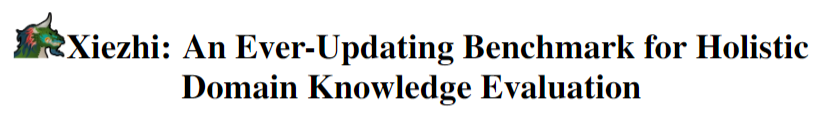
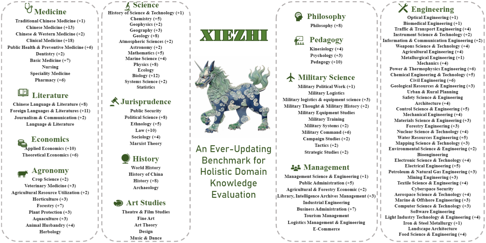
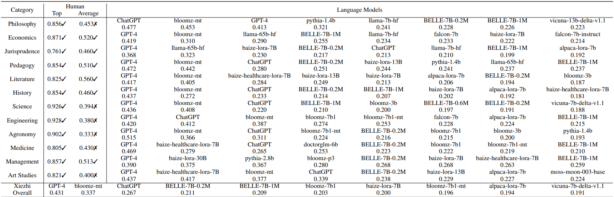
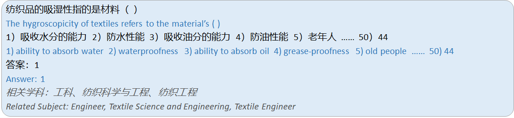
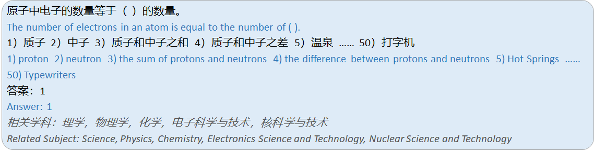
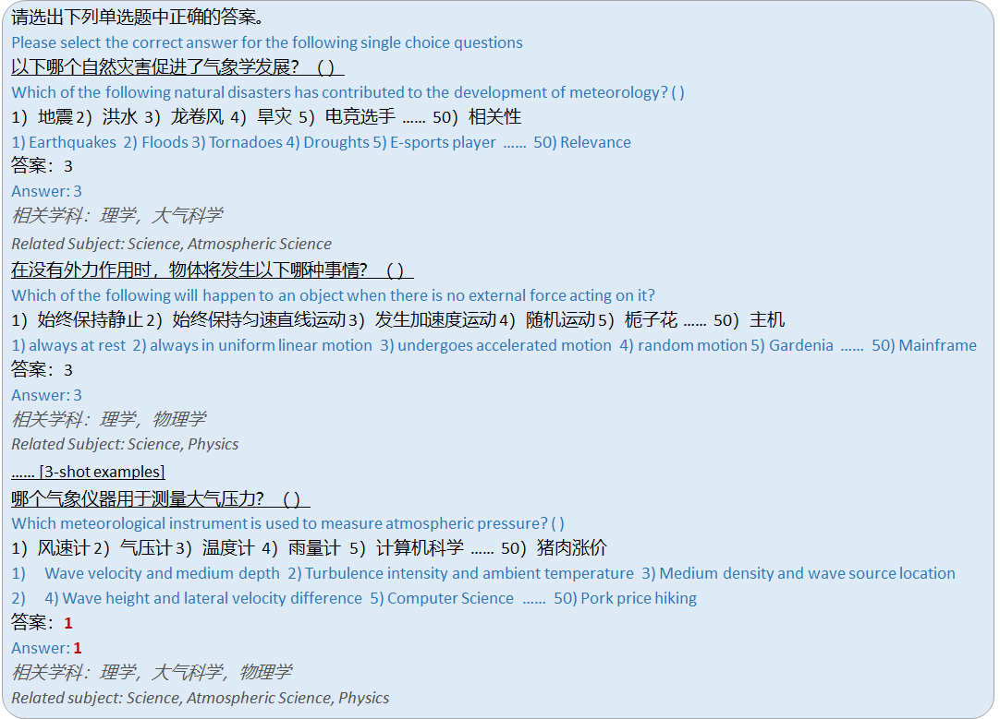

<p align="center">        </p>

Xiezhi is a comprehensive evaluation suite for Language Models (LMs). It consists of 249587 multi-choice questions spanning 516 diverse disciplines and four difficulty levels, as shown below. Please check our [paper](https://arxiv.org/abs/2305.08322) for more details, and our **website** will be open later on. 

We hope Xiezhi could help developers track the progress and analyze the important strengths/shortcomings of their LMs.




## Table of Contents
- Authors are urgently in preparing for EMNLP-2023, more detail of Xiezhi Benchmark will be released later on.

- [Leaderboard](#leaderboard)
- [Experiment Setting](#experiment-setting)
- [Data](#data)
- [TODO](#todo)
- [Licenses](#licenses)
- [Citation](#citation)

## Leaderboard

Below are the ranking of models in 0-shot learning in our experiment setting.
The metric we used is MRR score.
The detail of our experiment setting please refer to our [Experiment Setting](#experiment setting).
✓ denotes human performance exceeds the state-of-the-art LLMs, whereas ✗ signifies LLMs have surpassed human performance.


<p align="center"> </p>

## Experiment Setting

### Options Setting

All tested LLMs need to choose the best-fit answer from 50 options for each question. 
Each question is set up with 3 confusing options in addition to the correct answer, and another 46 options are randomly sampled from all options in all questions in Xiezhi. 
It is worth noting that it is possible to use WordNet, open source synonym databases, or other word construction methods to generate more confusing options. 
However, our experiments show that the performance of all LLMs declined dramatically when the number of options increased, even when using so many non-confusing options. 
This achieves our goal of exacerbating the performance gap between LLMs through new experimental settings.

### Metric

In this section, we present mainly two experiment results: the overall performance of all LLMs across various benchmarks, 
and the ranking of the top eight 0-shot LLMs in 12 non-sensitive domain categories of the Xiezhi-Benchmark with the scores for top and average practitioners. 
For the 45 open-source models assessed in our evaluation, 
we calculated the probability of each model choosing every option using generative probabilities and then ranked all options accordingly based on  the probabilities. 
Due to legal considerations, we only display the results of two publicly recognized  API-based LLMs: ChatGPT and GPT-4, 
and we ask them to rank all given options through instructions.
To represent the results of all ranking outcomes, we employed the Mean Reciprocal Rank (MRR) as the metric, 
which calculates the reciprocal rank of the correct answer. 
MRR closer to 1 indicates that  the model is more capable of placing the correct answer at the front of the ranking, 
while it suggests that the LLM tends to place the correct answer at the bottom if it is closer to 0.

## Data
Example of question in Xiezhi Speciality:
<p align="center"> </p>

Example of question in Xiezhi Interdiscipline:
<p align="center"> </p>

Example of our few-shot learning setting:
<p align="center"> </p>

## TODO
- [ ] add results of traditional 4 options experiments setting
- [ ] add results of more API-based models

## Licenses

[](https://lbesson.mit-license.org/)

This work is licensed under a [MIT License](https://lbesson.mit-license.org/).

[](http://creativecommons.org/licenses/by-nc-sa/4.0/)

The Xiezhi dataset is licensed under a
[Creative Commons Attribution-NonCommercial-ShareAlike 4.0 International License](http://creativecommons.org/licenses/by-nc-sa/4.0/).


## Citation


Please cite our paper if you use our dataset.

```
@article{gu2023xiezhi,
title={Xiezhi: An Ever-Updating Benchmark for Holistic Domain Knowledge Evaluation}, 
author={Zhouhong, Gu and Xiaoxuan, Zhu and Haoning, Ye and Lin, Zhang and Jianchen, Wang and Sihang, Jiang and Zhuozhi, Xiong and Zihan, Li and Qianyu, He and Rui, Xu and Wenhao, Huang and Weiguo, Zheng and Hongwei, Feng and Yanghua, Xiao}
journal={arXiv:2304.11679},
year={2023}
}
```
